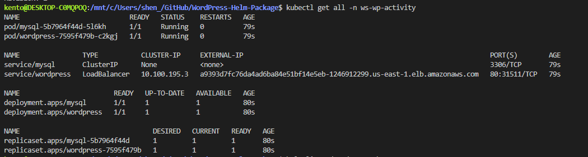

# WordPress Helm Package

# Pre-requisite (Connect to EKS Cluster)
aws eks update-kubeconfig --name shared-eks-cluster --region us-east-1
aws eks update-kubeconfig --name weishen_ce09-eks-cluster --region us-east-1

# Use to validate chart during the development
helm lint ./wordpress-chart

# Use this directly for customize Helm Chart
helm install wp-release ./wordpress-chart -n ws-wp-activity
helm upgrade --install wp-release ./wordpress-chart -n ws-wp-activity

# Create Helm Chart
helm create wordpress-chart

# Create namespace
kubectl create namespace <your-name>-wp-activity
kubectl create namespace ws-wp-activity

# Deploy the Helm Chart
helm install wp-release . -n <your-name>-wp-activity
helm install wp-release . -n ws-wp-activity

# Deploy the Helm Chart
helm upgrade wp-release . -n ws-wp-activity

Verify:
kubectl get all -n <your-name>-wp-activity
kubectl get all -n ws-wp-activity

# Get the external load balancer
kubectl get svc wordpress -n <your-name>-wp-activity
kubectl get svc wordpress -n ws-wp-activity

Example output:   
NAME        TYPE           CLUSTER-IP     EXTERNAL-IP        PORT(S)        AGE
wordpress   LoadBalancer   10.0.120.7     a1b2c3d4.elb.amazonaws.com   80:30968/TCP   2m
   
Take the EXTERNAL-IP or domain (e.g., a1b2c3d4.elb.amazonaws.com) and open it in your browser:   
http://a1b2c3d4.elb.amazonaws.com

# Mics:
kubectl describe pod wordpress-7595f479b-fv8m4 -n ws-wp-activity
helm uninstall wp-release -n ws-wp-activity
helm list -n ws-wp-activity -q | xargs -n1 -I{} helm uninstall {} -n ws-wp-activity

Results:
1.   
      
2.    
   
3.    
   
4. Service:   
  
   
5. Browser:   
       

6. Login:
   

# After update with mysql secret varaible then
 helm upgrade --install wp-release ./wordpress-chart -n ws-wp-activity

Secret:         
    
    
 Disable Decode:   
    

 

 # If db instance has been deployed, then explore the resources in namespace first.

 1. List all resource types (e.g., pods, secrets, services)
 kubectl get pods -n ws-wp-activity
 kubectl get secrets -n ws-wp-activity
 kubectl get svc -n ws-wp-activity

2. Get full YAML of a resource
kubectl get secret mysql-secret -n ws-wp-activity -oyaml
   

3. Extract a specific field from a secret (e.g., DB password)
kubectl get secret mysql-secret -n ws-wp-activity \
  -ojsonpath='{.data.password}' | base64 -d
   

4. Test database connectivity from within the cluster
kubectl exec -it deploy/mysql -n ws-wp-activity -- bash
   
Command explanation:   
   

Then inside the container:
mysql -h <db_hostname> -u <db_username> -p<db_password>
mysql -h localhost -u wpuser -pwppass123

Or, from another pod like WordPress:
mysql -h mysql -u wpuser -pwppass123
   

SHOW DATABASES;
   

Use different DB:
   